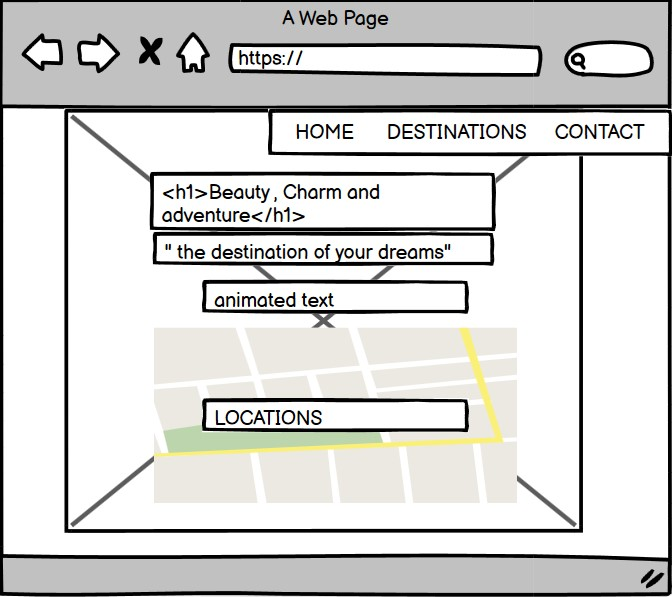
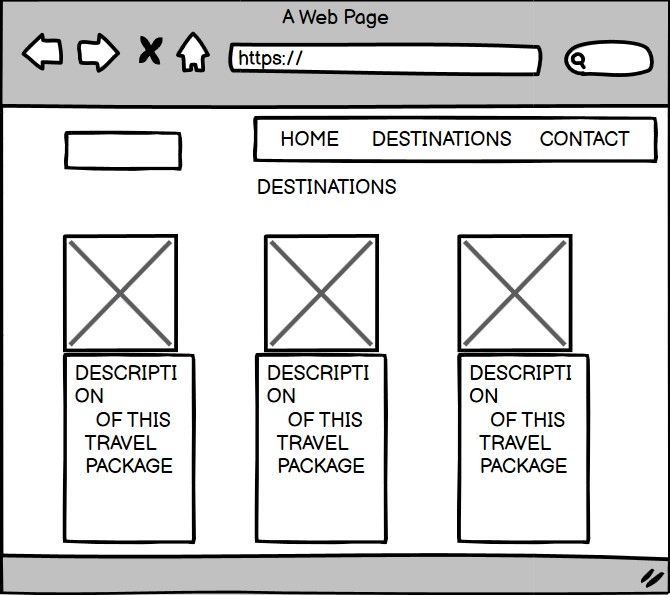
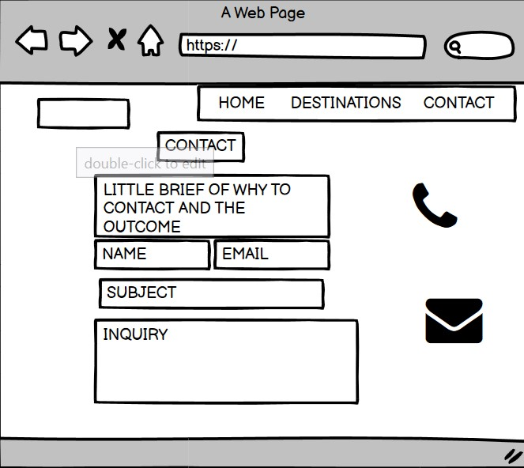

# HOLi-Dreams #

For the second Milestone Project I have decided to develop the concept of a Holiday Agency that launches three different holiday packages
every month. The site is very visual and engaging. Allows the user to see which kind of holliday pack is been launched each month and request 
full information to the agency that will help out on the booking and assesing process.

 
## UX ##

Project Goals:
 * Offer a new point of view in terms on booking holidays through and agency.
 * Engage with actual and future clients, as new products are always available using pictures of the places and the actual location of the three posible destinations.
 * Provide best service when asesoring and presenting the travel options, so clients can fulfil their needs.

### Design Process ###

##### Strategy Plane: ####

The main goal of the website is to ease the effort of the clients when looking for a getaway. The holiday packs are available only during
one month to buy or reserve but the date of the trip can be anytime.
A more visuable and detailed approach.

#### Scope Plane: ####

The features of the website were developed based on user needs. What a holiday finder website should have?
 * How many pages it will have.
 * Decide if the pages will be scrollable or separate.
 * Do online researches of other holiday websites and applications.
 * Use my personal expirience as a consumer.

#### Skeleton Plane: #### 

At this step of the designing process I have used Balsamiq wireframes to capture my overall idea and organization of the project.
Also I had the mentor session at this point, where I could decide what was the best structure of the project. Visual design and also the color palette
i wanted to use, in addition I start to decide the images I will go for, or at least the type I would look for.

   
    
     
    
   

 
#### Surface Plane: ####

At this stage of the process, I proceeded to start to design the website using Bootstrap. 
At the beggining of the designing process I decided to create a site which counted with at least 3 different and independant page, 
however I was not happy with the results , from the User expirience perspective and I decided to change it and do a scrollable website.
The hero image was taken from Unsplash library [Unsplash](https://unsplash.com/).
The typography used is from Google Fonts – Nixie One [Google Fonts](https://fonts.google.com/)
Colors used from the CSS3 palette color available at [W3Schools.com](https://www.w3schools.com/cssref/css_colors.asp)

## Features ##

The website counts with three pages, likable by the nav bar, making the navigation easy and handy;home page , destination page and contact page.

1. The Home page counts with a full screen landing image , the slogan and animated text presenting the destinations available of the month and 
   a google maps direct access where you can quickly spot the locations.
2. The Destinations page, offers a bootstrap interactive card lay out , with images and full description of the options you can choose.
3. The Contact page invites the user to connect with the agency directly and have a personalised expirience.

Technologies Used:
 1. HTML5 : Used to create the form and the content of the web site
	te.
 2.	CSS3 : Used to style the HTML
 3. Bootstrap Frameworks: Used some components; Header , footer and the card layout. 
    Also used the grid system to make the website responsive for all size devices.
 4. JavaScript to implement the interactive and contemporanean approach. 
 5. Gitpod and Github to write , test and deploy my code. 
 6. JQuery The project uses JQuery to simplify DOM manipulation.
    

## Testing ##

I have Validated the code using: 
 * HTML   [HTML-Validator](https://validator.w3.org/#validate_by_input) 
 * CSS    [CSS-Validator](https://jigsaw.w3.org/css-validator/#validate_by_input)
   

Tested the website in different browsers:    
* Chrome
* Edge
* Mozilla Firefox 
* Safary
    
I have also used the Inspect tool from Google Chrome to text the responsiveness of the website in different size devices and no errors have been shown
at the console. 
I have encountered few issues during the code validation process:
 1. Few CSS properties had the wrong attributes - fixed
 2. Some HTML tags where at the wrong postion - fixed
 3. The "Submit" button of the contact page was outside the form. - fixed
 4. Encountered few issues when linking the emailJS API to my website getting 404 error back. 
 To resolve the issue I had to move the email JS code to a different file (email.js)
 5. Seems to be an issue I cannot identify when linking emailJS. I do not recieve the emails to the email linked.
 

## Deployment ## 

This project was entirely built in Gitpod and deployed in GitHub. 

Deployment steps:

1. Log in into my GitHub 
2. Go to my repositories
3. choose the repository called 2MILESTONEPROJECT
4. Settings
5. Select Master branch
6. Validate selection.
7. The ulr of the website is displayed.

You can see the website [here](https://sarasanchezz.github.io/2MilestoneProject/)

Steps to run the code locally:

1. Open GitHub
2. Select desired repository
3. Click on clone or download .
4. Start your IDE.
5. Open the terminal.
6. Type git clone followed by the code of the repository at the terminal

## Credits ## 

### Content ###
- The content of the page is been written by me and at the projects page is been copied from the projects structure and requirements, from the module materials.
- There are some parts of the code taken from Bootstrap componenents and after have been adjusted and modified it 
 to my web needs as for example:
    - [Navbar](https://getbootstrap.com/docs/4.5/components/navbar/)
    - [Footer](https://getbootstrap.com/docs/4.5/components/card/#header-and-footer)
    - [Card-structure](https://getbootstrap.com/docs/4.5/components/card/)
    - [Text-Animation](https://speckyboy.com/css-javascript-text-animation-snippets/)
### Media ### 
- All the images from the Website have  been taken from [Unsplash](https://unsplash.com/)

### Acknowledgements ### 
I  founded very helpful and inspirational this websites and videos:
- [W3Schools.com](https://www.w3schools.com/cssref/css_colors.asp).
- [MDB](https://mdbootstrap.com/).
- [Onthebeach](https://www.onthebeach.co.uk/holidays?mv_pc=googlecpc&CampaignID=211389743&AdGroupID=14671341383&Keyword=kwd-696602348&MatchType=e&Device=c&AdID=391232768787&gclid=Cj0KCQiA5bz-BRD-ARIsABjT4ni3YJOeCVZ5-yHbUNmXAGWn2V9FLjhfYQBvLLBrl9sId-qzjr-wBTQaAqMhEALw_wcB)
- How to use the Bootstrap 4 grid - Demo site by Anna Gilhespy [Video](https://www.youtube.com/watch?v=zDpCejbl1sU)
- JavaScript tutorial [video](https://www.youtube.com/watch?v=W6NZfCO5SIk).
- Website tutorial with bootstrap [Video](https://www.youtube.com/watch?v=9cKsq14Kfsw).
- [Stackoverflow](https://stackoverflow.com/).
- Slack Community. 
- All the tutors who had assisted me during the process, the were all helpful and extremelly kind.